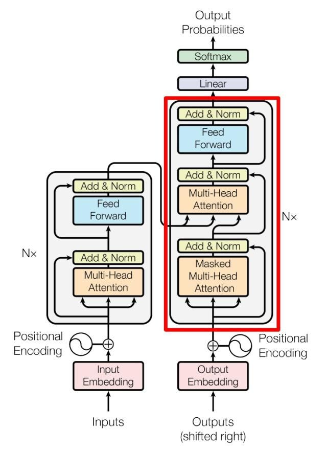
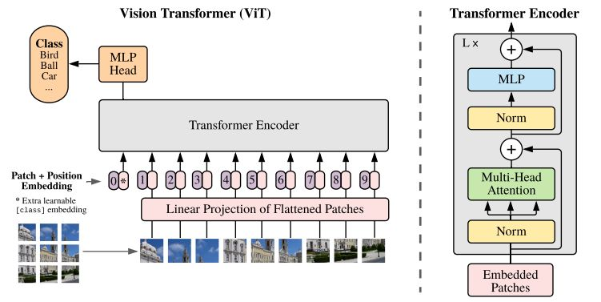

# 5.29海康威视
优化算法模型参数的思路和步骤
* 收集更多的数据：更多的数据有助于模型学习更准确的模式和规律，提供更好的训练基础。通过增加数据量，可以降低模型的过拟合程度。
* 数据预处理：对数据进行适当的预处理可以改善模型的性能。包括数据清洗、特征缩放、标准化、特征选择等。不同的数据预处理方法适用于不同的问题和模型类型。
* 参数初始化
* 网络结构调整：增加或减少层数、调整神经元的数量和连接方式等，可以影响模型的复杂度和性能。
* 超参数调优：超参数是指那些不能通过训练数据学习得到的参数，例如学习率、正则化系数、批量大小等。
* 交叉验证
* 正则化和防止过拟合

数据增强的方法
* 图像数据增强：
    * 随机裁剪：随机剪裁图像的一部分，以增加样本的多样性。
    * 翻转：随机水平或垂直翻转图像，增加数据的对称性。
    * 旋转：随机旋转图像一定角度，模拟不同的视角。
    * 缩放：随机调整图像的尺度大小。
    * 增加噪声：向图像中添加噪声，提高模型的鲁棒性。
* 文本数据增强：
    * 同义词替换：将文本中的某些词替换为其同义词，扩充数据集。
    * 随机删除：随机删除文本中的某些单词，模拟缺失或遗漏的情况。
    * 随机插入：在文本中随机插入额外的单词或短语，增加多样性。
    * 扰动顺序：随机打乱文本中单词的顺序，模拟不同的语序。
* 音频数据增强：
    * 速度扰动：调整音频的播放速度，模拟不同的语速。
    * 增加噪声：向音频中添加噪声，模拟不同的环境条件。
    * 时间扭曲：对音频进行时间伸缩或压缩，增加数据的多样性。
    * 频率滤波：对音频进行频率滤波，模拟不同的声音特征。

transformer的结构
* NLP中

  * decoder ：
    包含两个 Multi-Head Attention 层。
    第一个 Multi-Head Attention 层采用了 Masked 操作。
    第二个 Multi-Head Attention 层的K, V矩阵使用 Encoder 的编码信息矩阵C进  行计算，而Q使用上一个 Decoder block 的输出计算。
    最后有一个 Softmax 层计算下一个翻译单词的概率。
* cv中：
* 
  * decoder:
    MLP（task-based decoder和下游任务相关）
